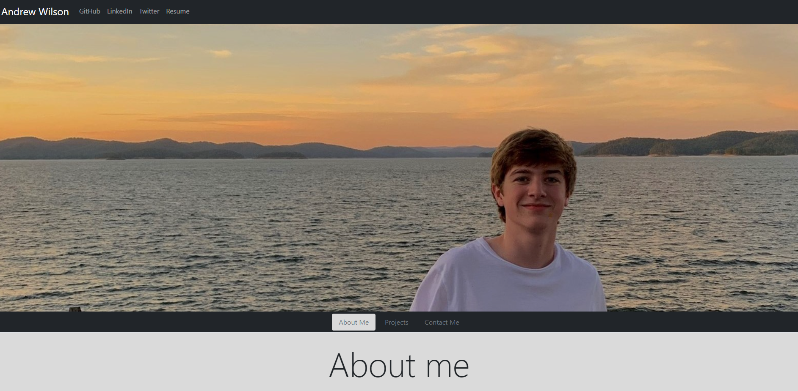
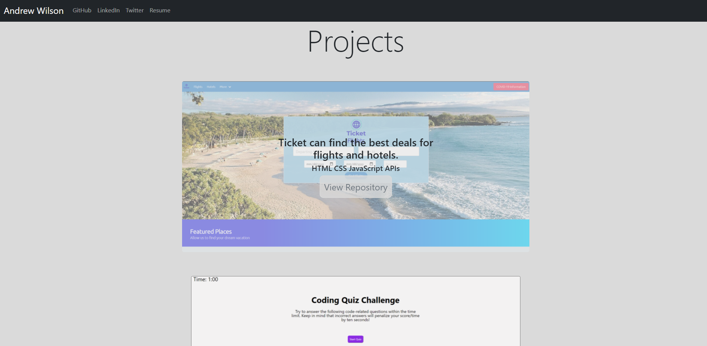

# Personal_Portfolio
Portfolio which hosts my projects and description of achievements along with strengths.  

Link to deployed website: https://andwilson36.github.io/Personal_Portfolio/

## Objectives 

```
- Make a mobile-friendly website which shows off skills with web design as well as projects and strengths

- Hvae a link to personal GitHub, Twitter, LinkedIn and email as well as phone number.

- Should be able to download updated resume through website.

```

### Images
This is the opening screen which features the navbar at the top with links to my socials and a picture.


This is a image of the projects tab which showcases some of my projects which have links to the repositories within.


